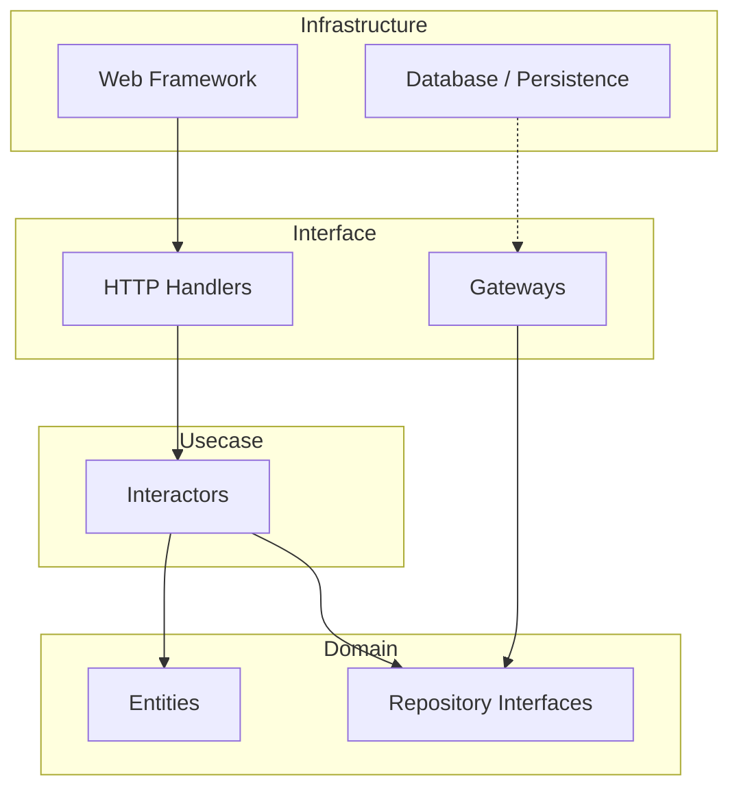

# 設計ドキュメント

---
**目的**: 異なる実装者が一貫した実装を行うことを保証し、解釈のずれを防ぐために十分な詳細を提供する。
---

## 概要
本機能は、Go言語によるバックエンド開発のための標準的なクリーンアーキテクチャ・ディレクトリ構成を提供します。
**ユーザー**: バックエンド開発者。
**影響**: `cmd` および `internal` パターンを用いた明確なレイヤー分離により、保守性とテスト容易性を向上させます。

### 目標
- Goの標準的なプロジェクトレイアウト (`cmd`, `internal`) の確立
- クリーンアーキテクチャの4層 (Domain, Usecase, Interface, Infrastructure) の分離
- 依存規則 (Dependency Rule) を物理的なディレクトリ構造で強制する基盤の作成

### 非目標
- Goソースファイル (`.go`) の作成
- 具体的なビジネスロジックの実装
- 外部ライブラリの導入

## アーキテクチャ

### アーキテクチャパターンと境界マップ
**選択されたパターン**: クリーンアーキテクチャ (レイヤードアーキテクチャ)

**アーキテクチャ統合**:
- **ドメイン層**: 外部依存を一切持たない核心部。
- **ユースケース層**: ドメイン層のみに依存し、アプリケーション固有のビジネスルールを持つ。
- **インターフェース層**: ユースケースと外部（HTTPなど）の変換を行うアダプタ。
- **インフラストラクチャ層**: データベースやフレームワークなどの詳細実装。

### テクノロジー・スタック
| レイヤー | 選択 / バージョン | 機能における役割 | 備考 |
|---|---|---|---|
| ランタイム | Go | バックエンド言語 | ディレクトリ構造の基準 |
| ビルド | Make / Go Modules | ビルドシステム | (構成のみのため対象外) |

## 要求事項の追跡可能性

| 要求事項 | サマリー | コンポーネント | インターフェース |
|---|---|---|---|
| 1.1 | コマンド層 (`cmd/api`) | エントリーポイント | N/A |
| 2.1 | ドメイン層ルート (`internal/domain`) | ドメイン層 | N/A |
| 2.2 | ドメインモデル (`model`) | ドメインエンティティ | N/A |
| 2.3 | ドメインリポジトリ (`repository`) | ドメインインターフェース | N/A |
| 3.1 | ユースケース層 (`internal/usecase`) | アプリケーションビジネスルール | N/A |
| 4.1 | インターフェース層 (`internal/interface/http`) | インターフェースアダプタ | N/A |
| 4.2 | HTTPハンドラ (`handler`) | HTTPコントローラ | N/A |
| 4.3 | HTTPミドルウェア (`middleware`) | HTTPミドルウェア | N/A |
| 5.1 | DB設定 (`infrastructure/database`) | DB設定 | N/A |
| 5.2 | 永続化実装 (`infrastructure/persistence`) | リポジトリ実装 | N/A |
| 6.1 | マイグレーション (`migrations`) | DBマイグレーション | N/A |

## コンポーネントとインターフェース

### ディレクトリ構造の定義

本設計はコードコンポーネントではなく、ファイルシステム上のディレクトリ構造を定義します。

#### [ルート / コマンド]

| コンポーネント | パス | 目的 | 要求事項のカバー範囲 |
|---|---|---|---|
| APIエントリーポイント | `cmd/api` | アプリケーションのエントリーポイント | 1.1 |
| マイグレーション | `migrations` | SQLマイグレーションファイルの配置場所 | 6.1 |

#### [内部 / ドメイン]

| コンポーネント | パス | 目的 | 要求事項のカバー範囲 |
|---|---|---|---|
| ドメインモデル | `internal/domain/model` | エンティティ・値オブジェクトの定義 | 2.1, 2.2 |
| リポジトリI/F | `internal/domain/repository` | リポジトリのインターフェース定義 | 2.1, 2.3 |

#### [内部 / ユースケース]

| コンポーネント | パス | 目的 | 要求事項のカバー範囲 |
|---|---|---|---|
| ユースケース | `internal/usecase` | アプリケーション固有のビジネスロジック | 3.1 |

#### [内部 / インターフェース]

| コンポーネント | パス | 目的 | 要求事項のカバー範囲 |
|---|---|---|---|
| HTTPルート | `internal/interface/http` | HTTP関連のアダプタ | 4.1 |
| ハンドラ | `internal/interface/http/handler` | リクエストハンドラ (Controller) | 4.2 |
| ミドルウェア | `internal/interface/http/middleware` | 共通処理 (Auth, Logging) | 4.3 |

#### [内部 / インフラストラクチャ]

| コンポーネント | パス | 目的 | 要求事項のカバー範囲 |
|---|---|---|---|
| データベース | `internal/infrastructure/database` | DB接続設定・ドライバ設定 | 5.1 |
| 永続化 | `internal/infrastructure/persistence` | リポジトリの実装 (SQLなど) | 5.2 |

## データモデル
N/A (ディレクトリ構造のみのため)

## エラーハンドリング
N/A

## テスト戦略
- **構造検証**: 作成されたディレクトリが存在することを検証するスクリプトまたは手動確認。
